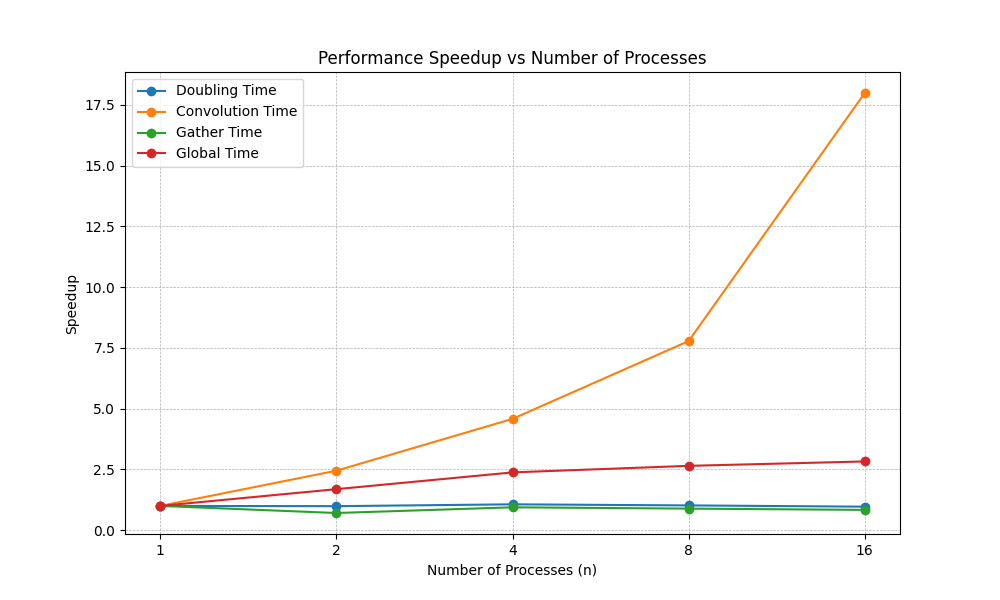

# Environment de calcul

- OS: Windows 11
- MPI: MS-MPI
- CPU: i5-12450H (8 cores / 12 threads)
- Cache (L1/L2/L3): 704KB / 7MB / 12MB

# Parallélisation d'images issues d'une vidéo

## Algorithme:
- Chaque processus calcule une range d'images. Lá il n'y a pas de communication interprocessus.

## Temps d'exécution

### Serial code: 
- Temps moyen de traitement: 1.9568471715256974
- Temps total de traitement: 72.4033453464508
- Global time:  73.33790922164917

### Code parallel
Le temps on était mesurés par le rank 0 (le plus lent généralement).

| n                         | 2      | 4      | 8      | 16      |
|---------------------------|--------|--------|--------|---------|
| Temps moyen de traitement | 1.7501 | 2.0522 | 2.8252 | 6.0143  |
| Temps total de traitement | 33.253 | 20.522 | 14.126 | 18.042  |
| Global time               | 33.612 | 20.771 | 14.280 | 18.144  |
| Speedup                   | 2.18	 | 3.52	  | 5.13   | 4.01    |

Je crois que le speedup meilleur que l’idéal pour n = 2 est seulement dû à de petites variations entre les exécutions. Donc, si on répète l’expérience plusieurs fois, le speedup moyen mesuré sera bien sûr inférieur à 2, mais très proche.

Pour n = 4 et n = 8, le speedup est bon, comme attendu.

Pour n = 16, on observe que le nombre de processus par rapport à la quantité de cœurs physiques de ma machine provoque des problèmes de concurrence pour le temps CPU, ce qui entraîne un mauvais speedup.

# Parallélisation d'une photo en haute résolution (1)

Comme le but est d'utiliser le minimum de mémoire possible, on va découper l'image de telle sorte que chaque processus ait (presque) la même quantité de pixels à traiter. De cette façon, la mémoire totale utilisée sera la même que celle du programme séquentiel. 

Pour cela, on doit charger et dupliquer l'image uniquement dans rank 0, puis la découper et l'envoyer aux autres ranks.

Cette approche ne serait pas la meilleur pour `movie_filter.py` car on doit grouper l'information calculer pour chaque processus à la fin de l'execution, ce que nous coût temps.

Je n'ai pas réussi à faire en sorte que le hash soit le même (peut-être un problem de précision flottant). Je sais que ce n'est pas un problème lié aux bords, car même avec un seul processus, le hash n'est pas le même. De plus, j'ai ajouté des frontières fantômes et utilisé l'argument `boundary="symm"`. Heureusement, l'image ne présente aucun artefact et semble identique à l'œil humain.

## Temps d'exécution (s)

| Metric           | n = 1  | n = 2  | n = 4  | n = 8  | n = 16  |
|------------------|--------|--------|--------|--------|---------|
| Doubling Time    | 3.934  | 3.973  | 3.691  | 3.853  | 4.057   |
| Convolution Time | 33.523 | 13.687 | 7.320  | 4.308  | 1.864   |
| Gather Time      | 3.331  | 4.697  | 3.533  | 3.745  | 3.980   |
| Global Time      | 44.175 | 26.147 | 18.569 | 16.679 | 15.612  |

Le temps (global - gather - conv - doubling) est associé au temps de communication entre les processus.

### Doubled Image (n = 8)

### Speedup

On observe un speedup très proche de l'optimal pour la convolution, mais le speedup global ne le suit pas en raison des communications interprocessus.

# Parallélisation d'une photo en haute résolution (2)

J'ai utilisé la même stratégie.

## Temps d'exécution (s)

| Metric           | n = 1  | n = 2  | n = 4  | n = 8  | n = 16  |
|------------------|--------|--------|--------|--------|---------|
| Doubling Time    | 3.602  | 4.009  | 3.594  | 3.567  | 3.735   |
| Convolution Time | 19.852 | 10.991 | 5.721  | 3.340  | 1.504   |
| Gather Time      | 3.230  | 4.567  | 3.874  | 3.768  | 3.804   |
| Global Time      | 29.721 | 23.647 | 17.261 | 15.416 | 14.712  |

### Doubled Image (n = 16)

### Speedup

# Remarques finales

On pourrait essayer de découper les lignes au lieu des colonnes afin d'éviter les cache misses tout en envoyant les images. Cela ne devrait pas beaucoup changer, car NumPy gère déjà bien les optimisations de cache avec ses arrays.